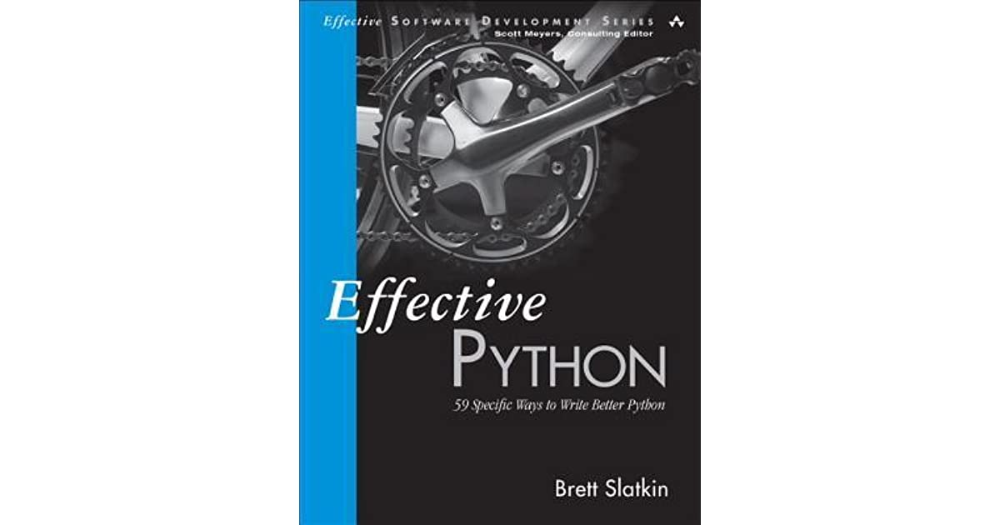

# My Reading Note in Python

## `Efficient Python: 59 Specific Ways to Write Better Python`

This repository contains notes that I took while reading this book.

In general, this is a very fruitful journey. The author covers eight major areas about python programming, 
which are super interesting and especially helpful for my daily work as a machine learning engineer. 
For these intermediate/senior level technical books, I find that the best way to absorb them is to code as I read them through. 
Therefore, all the codes in this repo are the examples that the author mentions in his book. 
Also, since a number of chapters require some additional background knowledge, I also write them down together with my own interpretation in separate files, which live in the same folders.

Anyway, I will be very glad if you find these examples are helpful for your projects, or you just have some fun reading these notes.
Please feel free to send me an email if you find a mistake or you don't agree with my interpretations. 

